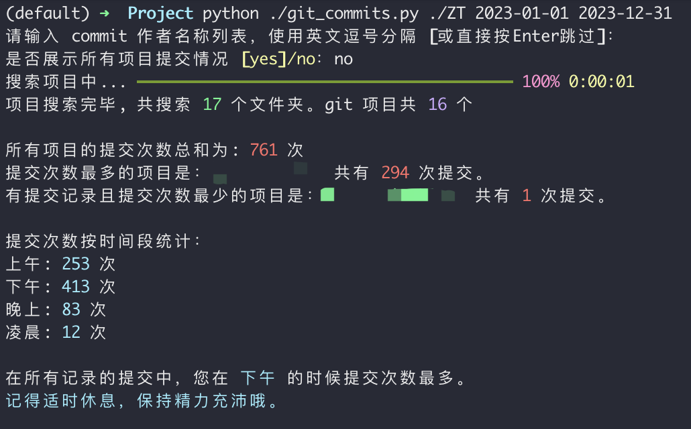

<div align="center">
    <h1>git-commits</h1>
    <p>查看过去一年的项目提交记录<br/><p/>
    
</div>


## 如何运行

1. 从源码运行

   ```shell
   git clone https://github.com/BianTan/git-commits.git
   cd git-commits
   # 安装依赖
   pip3 install -r requirements.txt
   # 查看过去一年
   python3 ./src/main.py <项目父目录>
   # 查看指定日期
   python3 ./src/main.py <项目父目录> 2023-01-01 2023-12-31
   ```

2. 从 [Release](https://github.com/BianTan/git-commits/releases/latest) 中下载对应包并解压，在命令行中运行:

   ```shell
   # 查看过去一年
   ./GitCommits <项目父目录>
   # 查看指定日期
   ./GitCommits <项目父目录> 2023-01-01 2023-12-31
   ```
